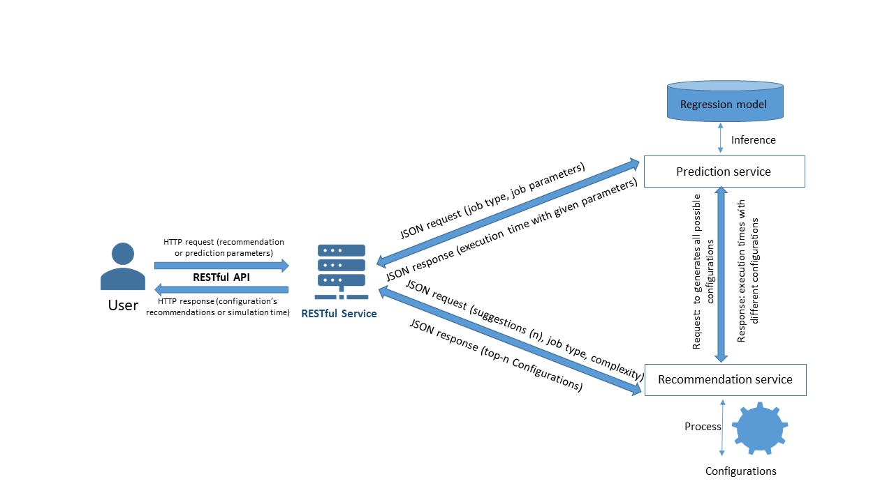

# MapReduce Optimization Service



# API endpoints


|Service Name | Method |  URL | Description |
|:----------:|:---:|--|:----------------------------------
|[Prediction Service](#prediction-service-example-)| POST | `/predict/{application_name}`|  The MapReduce _application name_ and _configuration parameters_ are passed as input parameters, and as a result, the service provides the application _execution time_ with the specified parameters.
|[Recommendation Service](#recommendation-service-example-)| POST | `/recommend/{application_name}/{top_n}`|The name of the MapReduce _application_, _possible configurations_, and numeric _top_n_ parameters are passed as input parameters, and as a result, the service provides the _top_n best configurations_ with their _execution time_ (if top_n = 0 show all ).

Service supports the following applications. <br/>

|Application | application_name |
|:---------:|:--------:
|Log Analyzer| [loganalyzer](./src/service/helper/configurations/loganalyzer.json)
|Word Count| [wordcount](./src/service/helper/configurations/wordcount.json)
|K-Means| [kmeans](./src/service/helper/configurations/kmeans.json)
|TestDFSIO| [testdfsio](./src/service/helper/configurations/testdfsio.json)
|TeraSort| [terasort](./src/service/helper/configurations/terasort.json)

# Prediction Service Example <br/>

**URL:** `/predict/loganalyzer`

**Request Body**

```json
{
  "environment": "hadoop",
  "data_size_gb": 4,
  "nodes_count": 16,
  "compression": "lz4",
  "ram_over_hdfs": false
}
```

**Response Body**

```json
{
  "environment": "hadoop",
  "nodes_count": 16,
  "data_size_gb": 4,
  "ram_over_hdfs": false,
  "compression": "lz4",
  "execution_time": 105.0
}
```

# Recommendation Service Example <br/>

**URL:** `/recommend/loganalyzer/2`

**Request Body**

```json
{
  "environment": "spark",
  "data_size_gb": 16,
  "nodes_count": 8
}
```

**Response Body**

```json
[
  {
    "environment": "spark",
    "nodes_count": 8,
    "data_size_gb": 16,
    "ram_over_hdfs": false,
    "compression": "zstd",
    "execution_time": 67.0
  },
  {
    "environment": "spark",
    "nodes_count": 8,
    "data_size_gb": 16,
    "ram_over_hdfs": false,
    "compression": "lz4",
    "execution_time": 70.0
  }
]
```
